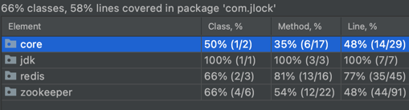
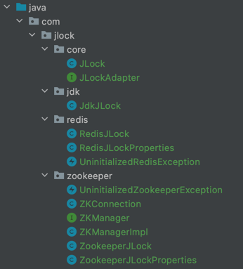

# JLock 分布式锁面向学习实现

## 说明
代码非常简单,适合学习使用,不适合在生产环境中使用

## 快速开始

```java
Lock lock = JLock.Default();
lock.lock();
lock.unlock();
```
上述代码实现一个JDK本地公平锁

这仅仅是默认的一个演示实现

### 重点在于分布式锁

使用 Redis 分布式锁非常简单
```java
RedisJLockProperties redisJLockProperties = new RedisJLockProperties();
redisJLockProperties.setHost("localhost");
redisJLockProperties.setPort(6379);
RedisJLock redisJLock =  RedisJLock(redisJLockProperties, "test_key");
redisJLock.lock();
redisJLock.unlock();
```

使用 Zookeeper 锁依然非常简单

```java
ZookeeperJLockProperties zookeeperJLockProperties = ZookeeperJLockProperties.Local(2181);
ZookeeperJLock zookeeperJLock = new ZookeeperJLock(zookeeperJLockProperties, "test_key");
zookeeperJLock.lock();
zookeeperJLock.unlock();
```


可以看到它们的使用方式基本一致,原因是它们都实现了`JLockAdapter`接口


## 单元测试覆盖情况



## 简洁的目录结构




## 与Spring集成

TODO


## 如何贡献
fork 本项目到您的仓库修改后提交 PR 即可

我会及时合并

## 交流

微信:K60001